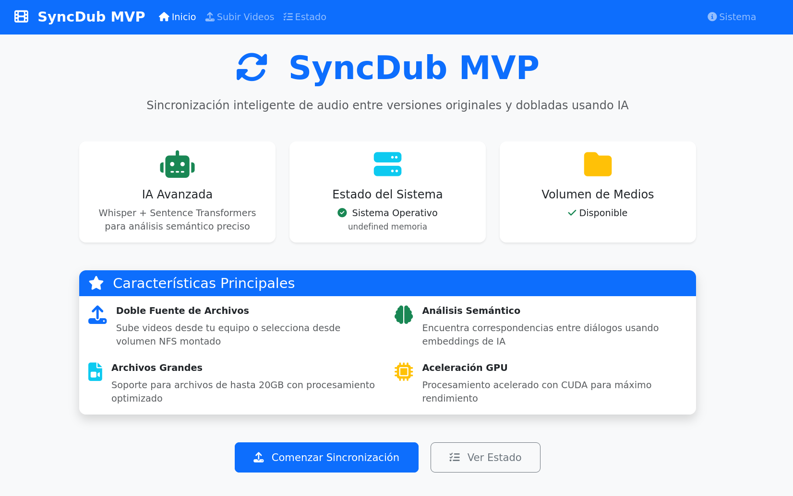
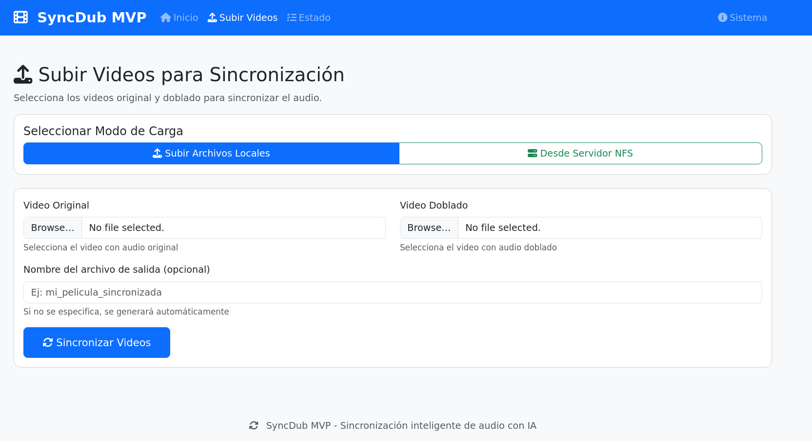

# 🎬 SyncDub MVP - Versión GPU Optimizada

**Sincronización inteligente de audio entre versiones originales y dobladas usando IA**

SyncDub MVP es una aplicación web que utiliza inteligencia artificial local para sincronizar automáticamente las pistas de audio entre versiones originales y dobladas de películas. La aplicación procesa ambos videos, transcribe los audios, empareja las frases por significado semántico y genera un archivo MKV final con ambas pistas de audio sincronizadas.





[](https://docker.com)
[](https://nvidia.com)
[](https://python.org)
[](https://flask.palletsprojects.com)

## 🚀 Características Principales

- **🧠 IA Avanzada**: Whisper + Sentence Transformers para análisis semántico preciso
- **🎮 Aceleración GPU**: Soporte completo para CUDA y procesamiento acelerado
- **📁 Doble Fuente**: Subida local o selección desde volumen NFS montado
- **📦 Archivos Grandes**: Soporte para archivos de hasta 20GB
- **🔧 Configuración Flexible**: Variables de entorno para todos los parámetros
- **📊 Monitoreo Completo**: Endpoints de salud y información del sistema
- **🐳 Docker Optimizado**: Contenedores con límites de recursos y healthcheck

## 📋 Requisitos del Sistema

### Mínimos
- **OS**: Ubuntu 20.04+ / CentOS 8+ / Debian 11+
- **RAM**: 4GB disponible
- **Disco**: 10GB libres
- **Docker**: 20.10+
- **Docker Compose**: 2.0+

### Recomendados
- **RAM**: 8GB+ disponible
- **GPU**: NVIDIA con 4GB+ VRAM
- **Disco**: 50GB+ libres (para archivos grandes)
- **CPU**: 4+ cores

### Para GPU (Opcional pero Recomendado)
- **Drivers NVIDIA**: 470+
- **CUDA**: 11.8+
- **nvidia-container-toolkit**: Instalado

## 🛠️ Instalación Rápida

### 1. Clonar/Descargar Proyecto
```bash
# Si tienes el zip
unzip syncdub-mvp-complete.zip
cd syncdub-mvp-complete

# O si tienes git
git clone <repository-url>
cd syncdub-mvp
```

### 2. Configurar Variables de Entorno
```bash
# Copiar archivo de ejemplo
cp .env.example .env

# Editar configuración según tu entorno
nano .env
```

### 3. Iniciar Aplicación
```bash
# Ejecutar script de inicio
./start.sh
```

¡Eso es todo! La aplicación estará disponible en `http://localhost:5000`

## ⚙️ Configuración Detallada

### Variables de Entorno Principales

```bash
# === CONFIGURACIÓN BÁSICA ===
FLASK_ENV=production
SECRET_KEY=tu-clave-secreta-unica
APP_PORT=5000

# === DIRECTORIOS ===
UPLOADS_DIR=./uploads
OUTPUT_DIR=./output
MODELS_DIR=./models

# === VOLUMEN NFS ===
MEDIA_SOURCE_ENABLED=true
MEDIA_SOURCE_PATH=/mnt/nfs/videos

# === RECURSOS GPU ===
MAX_MEMORY=8G
MAX_CPUS=4.0
NVIDIA_VISIBLE_DEVICES=all

# === MODELOS IA ===
WHISPER_MODEL=base
SENTENCE_TRANSFORMER_MODEL=paraphrase-multilingual-MiniLM-L12-v2

# === ARCHIVOS ===
MAX_CONTENT_LENGTH=21474836480  # 20GB
ALLOWED_EXTENSIONS=mp4,avi,mkv,mov,wmv,flv,webm
```

### Configuración por Escenario

#### 🖥️ Servidor Potente con GPU y NFS
```bash
MEDIA_SOURCE_ENABLED=true
MEDIA_SOURCE_PATH=/mnt/nfs/videos
MAX_MEMORY=16G
MAX_CPUS=8.0
WHISPER_MODEL=large
NVIDIA_VISIBLE_DEVICES=all
```

#### 💻 Servidor GPU Limitado
```bash
MEDIA_SOURCE_ENABLED=false
MAX_MEMORY=8G
MAX_CPUS=4.0
WHISPER_MODEL=base
NVIDIA_VISIBLE_DEVICES=0
```

#### 🧪 Desarrollo Local
```bash
FLASK_ENV=development
MEDIA_SOURCE_ENABLED=false
LOG_LEVEL=DEBUG
WHISPER_MODEL=tiny
MAX_MEMORY=4G
```

## 🎯 Uso de la Aplicación

### 1. Acceso Web
Navega a `http://localhost:5000` en tu navegador

### 2. Subir Videos
- **Opción A**: Subir archivos desde tu equipo (máx. 20GB)
- **Opción B**: Seleccionar desde volumen NFS montado

### 3. Configurar Procesamiento
- Selecciona video original y doblado
- Opcionalmente, especifica nombre personalizado
- Inicia sincronización

### 4. Monitorear Progreso
- Ve el progreso en tiempo real
- Descarga el archivo MKV resultante

### 5. Gestionar Tareas
- Revisa el estado de todas las tareas
- Descarga archivos completados

## 🔧 Comandos Útiles

### Docker Compose
```bash
# Ver logs en tiempo real
docker compose logs -f

# Reiniciar servicios
docker compose restart

# Detener aplicación
docker compose down

# Reconstruir imagen
docker compose build --no-cache
```

### Monitoreo
```bash
# Estado del sistema
curl http://localhost:5000/api/health

# Información detallada
curl http://localhost:5000/api/system-info

# Estado GPU dentro del contenedor
docker exec syncdub-mvp nvidia-smi

# Uso de recursos
docker stats syncdub-mvp
```

### Debugging
```bash
# Acceder al contenedor
docker exec -it syncdub-mvp bash

# Ver logs específicos
docker compose logs syncdub-app

# Verificar volúmenes
docker volume ls | grep syncdub
```

## 📊 API Endpoints

### Salud y Sistema
- `GET /api/health` - Estado del servicio
- `GET /api/system-info` - Información del sistema

### Medios
- `GET /api/media/status` - Estado del volumen NFS
- `GET /api/media/list?path=<path>` - Listar archivos

### Procesamiento
- `POST /api/upload` - Subir y procesar videos
- `GET /api/status/<task_id>` - Estado de tarea
- `GET /api/download/<task_id>` - Descargar resultado
- `GET /api/tasks` - Listar todas las tareas

## 🐛 Solución de Problemas

### Problema: Puerto Ocupado
```bash
# Verificar qué usa el puerto
lsof -i :5000

# Cambiar puerto en .env
echo "APP_PORT=5001" >> .env
```

### Problema: Sin Acceso GPU
```bash
# Verificar drivers NVIDIA
nvidia-smi

# Instalar nvidia-container-toolkit
curl -s -L https://nvidia.github.io/nvidia-container-runtime/gpgkey | sudo apt-key add -
distribution=$(. /etc/os-release;echo $ID$VERSION_ID)
curl -s -L https://nvidia.github.io/nvidia-container-runtime/$distribution/nvidia-container-runtime.list | sudo tee /etc/apt/sources.list.d/nvidia-container-runtime.list
sudo apt-get update
sudo apt-get install nvidia-container-toolkit
sudo systemctl restart docker
```

### Problema: Memoria Insuficiente
```bash
# Reducir modelo Whisper
echo "WHISPER_MODEL=tiny" >> .env

# Reducir límites de memoria
echo "MAX_MEMORY=4G" >> .env
echo "RESERVED_MEMORY=1G" >> .env
```

### Problema: Volumen NFS Inaccesible
```bash
# Verificar montaje
mount | grep nfs

# Verificar permisos
ls -la /mnt/nfs/videos

# Configurar UID/GID correctos
echo "PUID=$(id -u)" >> .env
echo "PGID=$(id -g)" >> .env
```

## 📁 Estructura del Proyecto

```
syncdub-mvp/
├── app/
│   ├── services/
│   │   └── sync_service.py      # Servicio de sincronización IA
│   ├── utils/
│   │   └── file_utils.py        # Utilidades de archivos
│   ├── api.py                   # Endpoints API
│   ├── main.py                  # Rutas principales
│   └── __init__.py
├── static/
│   ├── css/
│   │   └── style.css            # Estilos personalizados
│   └── js/
│       ├── main.js              # JavaScript principal
│       └── upload.js            # JavaScript de upload
├── templates/
│   ├── base.html                # Template base
│   ├── index.html               # Página principal
│   ├── upload.html              # Página de upload
│   └── status.html              # Página de estado
├── uploads/                     # Archivos subidos
├── output/                      # Archivos procesados
├── models/                      # Modelos IA descargados
├── video_source/                # Volumen NFS (opcional)
├── app.py                       # Aplicación principal
├── config.py                    # Configuración
├── requirements.txt             # Dependencias Python
├── Dockerfile                   # Imagen Docker
├── docker-compose.yml           # Orquestación
├── start.sh                     # Script de inicio
├── .env.example                 # Variables de entorno
└── README.md                    # Esta documentación
```

## 🔒 Consideraciones de Seguridad

- **Archivos Temporales**: Se limpian automáticamente
- **Validación**: Tipos y tamaños de archivo verificados
- **Contenedor**: Usuario no-root por defecto
- **Red**: Aislamiento con red personalizada
- **Recursos**: Límites configurados para prevenir DoS

## 🚀 Optimizaciones de Rendimiento

- **GPU**: Aceleración CUDA para Whisper y Transformers
- **Memoria**: Gestión inteligente con limpieza automática
- **Chunks**: Procesamiento por segmentos para archivos grandes
- **Cache**: Modelos pre-descargados en imagen Docker
- **Paralelización**: Múltiples hilos para operaciones I/O

## 📈 Monitoreo y Métricas

- **Healthcheck**: Verificación automática cada 30s
- **Logs**: Rotación automática con límites de tamaño
- **Recursos**: Monitoreo de CPU, memoria y GPU
- **Tareas**: Seguimiento de estado y progreso
- **Errores**: Logging detallado para debugging

## 🤝 Contribución

1. Fork el proyecto
2. Crea una rama para tu feature (`git checkout -b feature/AmazingFeature`)
3. Commit tus cambios (`git commit -m 'Add some AmazingFeature'`)
4. Push a la rama (`git push origin feature/AmazingFeature`)
5. Abre un Pull Request

## 📄 Licencia

Este proyecto está bajo la Licencia MIT - ver el archivo [LICENSE](LICENSE) para detalles.

## 🙏 Agradecimientos

- **OpenAI Whisper** - Transcripción de audio
- **Sentence Transformers** - Análisis semántico
- **FFmpeg** - Procesamiento de video/audio
- **Flask** - Framework web
- **Docker** - Containerización
- **Bootstrap** - Interfaz de usuario

---

**¿Necesitas ayuda?** Abre un issue en el repositorio o consulta la documentación de troubleshooting arriba. 🚀

